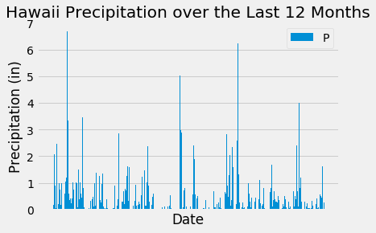
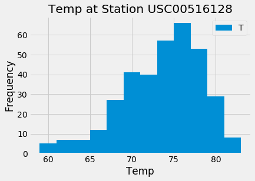
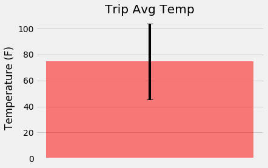
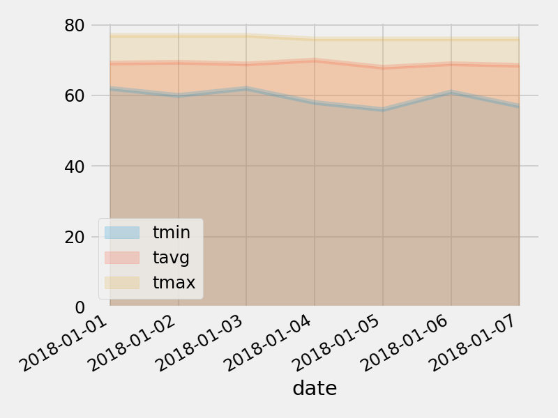

# sqlalchemy-challenge
Homework 10 for SQL Alchemy

Honolulu, Hawai'i, Trip Planning Analysis

To begin, use Python and SQLAlchemy to do basic climate analysis and data exploration of your climate database. All of the following analysis should be completed using SQLAlchemy ORM queries, Pandas, and Matplotlib.

<h2>Precipitation Analysis</h2>
Downloaded the provided data for all dates between 08/23/2016 to 08/23/2017. The 12-month precipitation histogram distribution is shown below.

Summary statistics were also generated in pandas.

<h2>Station Analysis</h2>
Bin the temperature data by the number of observation counts, in descending order. The most active station, USC00516128, was explored in a temperature histograms below.

<h2>Climate App</h2>
Now that you have completed your initial analysis, design a Flask API based on the queries that you have just developed. Several routes for the app were created:
`/api/v1.0/precipitation`
`/api/v1.0/stations`
`/api/v1.0/tobs`
`/api/v1.0/<start>` and `/api/v1.0/<start>/<end>`
